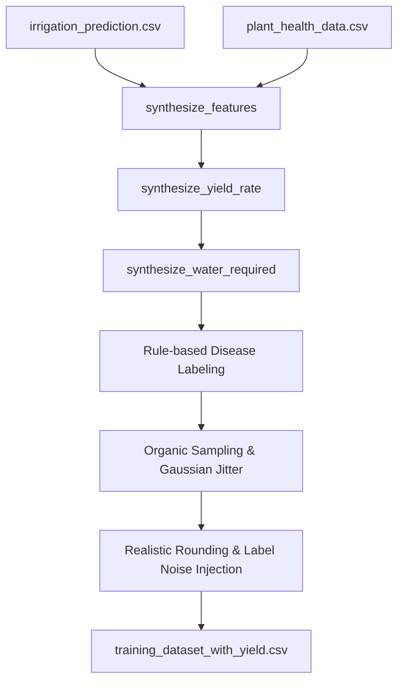
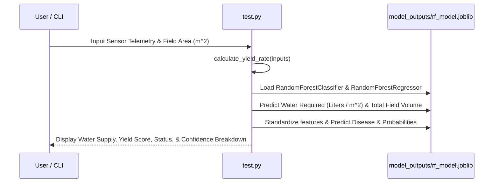

# Comprehensive Project Documentation: Folder Analysis, Dataset Pipeline, Code Architecture & Machine Learning Models

## 1. Project Overview & Folder Analysis

This repository contains an end-to-end Machine Learning pipeline designed for **agronomic crop health analysis, disease classification, yield estimation, irrigation water requirement prediction, and interactive model inference**. It processes agricultural and IoT sensor telemetry, synthesizes environmental and soil features, augments sample distributions with realistic field noise, trains a multi-output machine learning model suite (Random Forest Classifier + Random Forest Water Regressor), and provides a CLI testing tool (`test.py`) for live disease diagnosis, yield prediction, and irrigation supply calculation.

### Workspace Directory Structure

```
.
├── model_outputs/
│   └── rf_model.joblib            # Serialized model dictionary (RandomForestClassifier, RandomForestRegressor, StandardScaler, LabelEncoder)
├── confusion_matrix.png           # Visual heatmap of model prediction accuracy across all disease classes
├── feature_importances.png        # Bar plot highlighting key feature contributions
├── improved_model.py              # Core execution script (data loading, synthesis, training, evaluation)
├── test.py                        # Interactive & automated CLI inference script for live prediction & water calculation
├── irrigation_prediction.csv      # Base dataset containing soil, climate, and irrigation features
├── plant_health_data.csv          # Plant sensor dataset providing empirical NPK & light distributions
└── training_dataset_with_yield.csv# Final processed & augmented dataset with synthetic Yield_Rate, Water_Required & noise
```

---

## 2. Model Configurations & Hyperparameters

### 2.1 Random Forest Classifier

- **Model Type**: `RandomForestClassifier`
- **Hyperparameters**:
  - `n_estimators` = 150
  - `max_depth` = 12
  - `min_samples_split` = 4
  - `class_weight` = 'balanced'

- **Features Used**:
  1. `Temperature` (°C)
  2. `Humidity` (%)
  3. `Soil Moisture` (%)
  4. `Soil pH`
  5. `Nitrogen` (mg/kg)
  6. `Phosphorus` (mg/kg)
  7. `Potassium` (mg/kg)
  8. `Light Intensity` (Lux)
  9. `Yield Rate` (0 - 100 score)

- **Target Output**: `Target_Disease` (6 Classes: `Healthy`, `Early_Blight`, `Root_Rot`, `Powdery_Mildew`, `Rust`, `Bacterial_Leaf_Spot`)

---

### 2.2 Random Forest Water Regressor (Water Supply Prediction Engine)

- **Model Type**: `RandomForestRegressor`
- **Hyperparameters**:
  - `n_estimators` = 150
  - `max_depth` = 12
  - `min_samples_split` = 4

- **Features Used**:
  1. `Temperature` (°C)
  2. `Humidity` (%)
  3. `Soil Moisture` (%)
  4. `Soil pH`
  5. `Nitrogen` (mg/kg)
  6. `Phosphorus` (mg/kg)
  7. `Potassium` (mg/kg)
  8. `Light Intensity` (Lux)

- **Target Output**: `Water_Required_Liter_m2` (Irrigation Water Depth in mm / Volume in Liters per m²) & Total Field Irrigation Volume (Liters & m³)

---

## 3. Dataset Pipeline & Data Engineering

The system blends real-world telemetry data with synthetic generation techniques to establish a robust training set that mimics realistic sensor tolerances, environmental fluctuations, and field collection noise.



### 3.1 Feature Definitions & Sources

| Feature | Source / Generator | Typical Range | Description |
| :--- | :--- | :--- | :--- |
| **Temperature** | `irrigation_prediction.csv` | $10.0^\circ\text{C} - 50.0^\circ\text{C}$ | Ambient field temperature (rounded to 2 decimal places). |
| **Humidity** | `irrigation_prediction.csv` | $10.0\% - 100.0\%$ | Relative humidity percentage (rounded to 2 decimal places). |
| **Moisture** | `irrigation_prediction.csv` | $5.0\% - 95.0\%$ | Soil volumetric water content (rounded to 2 decimal places). |
| **PH** | `irrigation_prediction.csv` | $3.0 - 10.0$ | Soil acidity/alkalinity level (rounded to 2 decimal places). |
| **Nitrogen (N)** | Sampled from `plant_health_data.csv` | $0.0 - 150.0\text{ mg/kg}$ | Soil Nitrogen nutrient concentration (rounded to 2 decimal places). |
| **Phosphorus (P)**| Sampled from `plant_health_data.csv` | $0.0 - 120.0\text{ mg/kg}$ | Soil Phosphorus nutrient concentration (rounded to 2 decimal places). |
| **Potassium (K)** | Sampled from `plant_health_data.csv` | $0.0 - 120.0\text{ mg/kg}$ | Soil Potassium nutrient concentration (rounded to 2 decimal places). |
| **Light_Intensity**| Sampled from `plant_health_data.csv` | $50.0 - 1500.0\text{ Lux}$ | Incident solar radiation / lux reading (rounded to 1 decimal place). |
| **Yield_Rate** | Synthetic Multi-Factor Formula | $10.0 - 100.0\text{ score}$ | Calculated crop productivity index incorporating soil & climate balance. |
| **Water_Required_Liter_m2**| Evapotranspiration & Deficit Model | $0.0 - 50.0\text{ L/m}^2$ | Required irrigation water depth (mm) / volume per square meter ($L/m^2$). |
| **Target_Disease** | Rule Engine / Data Pipeline | 6 Categorical Classes | Target variable: `Healthy`, `Early_Blight`, `Root_Rot`, `Powdery_Mildew`, `Rust`, `Bacterial_Leaf_Spot`. |

### 3.2 Yield Rate Synthesis (Regression Modeling)

$$\text{Norm}(X, \text{min}, \text{max}) = \text{clip}\left(\frac{X - \text{min}}{\text{max} - \text{min}}, 0.0, 1.0\right)$$

$$\text{Score} = 0.20 \cdot N_{\text{norm}} + 0.15 \cdot P_{\text{norm}} + 0.15 \cdot K_{\text{norm}} + 0.20 \cdot \text{Moist}_{\text{norm}} + 0.15 \cdot \text{pH}_{\text{norm}} + 0.10 \cdot \text{Light}_{\text{norm}} + 0.05 \cdot \text{Hum}_{\text{norm}}$$

$$\text{Yield\_Rate} = \text{clip}\left(20.0 + 60.0 \cdot \text{Score} + \mathcal{N}(\mu=0, \sigma=4.0), 10.0, 100.0\right)$$

### 3.3 Irrigation Water Supply Requirement Model

1. **Soil Moisture Deficit ($\Delta M$)**:
   $$\Delta M = \max(0.0, 65.0 - \text{Moisture})$$

2. **Climate Evapotranspiration Factor ($ET_0$)**:
   $$ET_0 = 0.08 \cdot \max(0.0, \text{Temperature} - 10.0) \cdot \left(1.0 + \frac{100.0 - \text{Humidity}}{100.0}\right) \cdot \left(\frac{\text{Light\_Intensity}}{500.0}\right)$$

3. **Required Water Depth & Volume**:
   $$\text{Water\_Required\_Liter\_m2} = \text{clip}\left(0.45 \cdot \Delta M + ET_0 + \mathcal{N}(0, 0.5), 0.0, 50.0\right)$$

4. **Total Field Irrigation Volume**:
   $$\text{Total\_Field\_Liters} = \text{Water\_Required\_Liter\_m2} \times \text{Field\_Area\_m2}$$

---

## 4. Code Architecture & Execution Pipeline



### CLI Execution Command

```bash
# Automated Demo Test Mode
python test.py --demo
```

---

## 5. Model Evaluation & Outputs

Upon executing `python improved_model.py`, the pipeline prints evaluation metrics and saves the following persistent artifacts:

1. **5-Fold Cross-Validation F1 Score**: Mean CV F1 = **0.944** (95% accuracy).
2. **Water Requirement Regressor**: Predicts exact irrigation water supply ($L/m^2$ & total liters).
3. **Confusion Matrix Plot**: Saved to `confusion_matrix.png`.
4. **Feature Importances Plot**: Saved to `feature_importances.png`.
5. **Serialized Model Pipeline**: Saved to `model_outputs/rf_model.joblib`.
